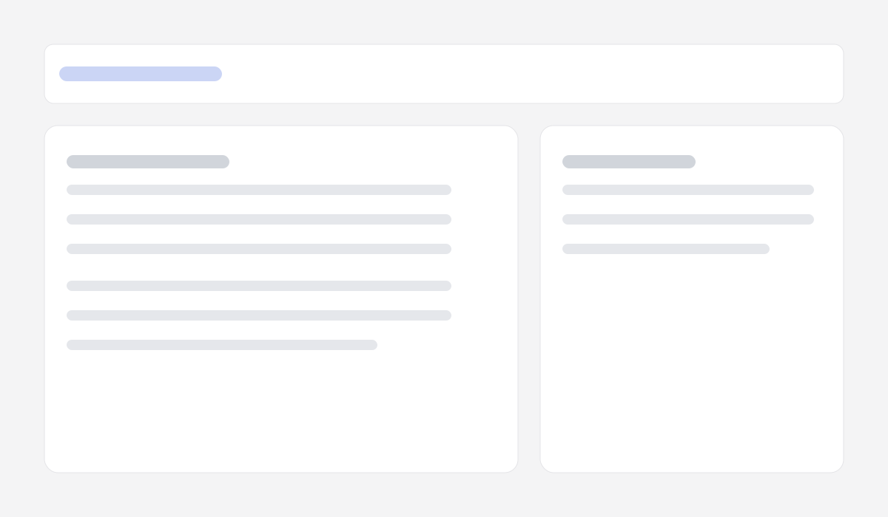
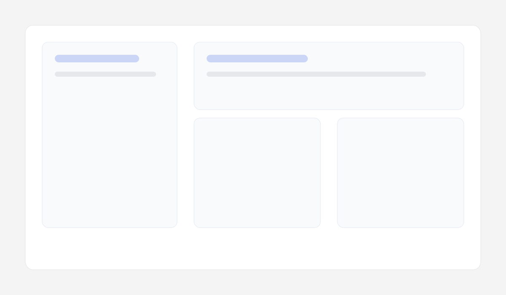

# Open Resume Builder

Build, preview, and export a resume/portfolio without a database. The app stores profiles locally in IndexedDB, supports multiple templates, and exports a static site bundle that works on any host.

## Screenshots




## Features

- Multi-profile resume editor (local IndexedDB persistence)
- Separate portfolio and resume templates with live preview
- DaisyUI theme picker with instant updates
- Export JSON backups and a static viewer bundle (.zip)
- Print-friendly PDF export

## Quickstart

```bash
npm install
npm run dev
```

Open http://localhost:3000 to start editing.

## How data works

Resume data is stored as `Resume` JSON (see `src/lib/schema/resume.ts`). Each profile is saved in IndexedDB under the `profiles` store and keyed by `profileId`. Templates and themes are stored separately for portfolio and resume outputs under `ui.portfolio` and `ui.resume`.

The static viewer expects a `resume.json` file in the same folder as `index.html`. It reads `resume.ui.portfolio` for the portfolio view and `resume.ui.resume` for the resume view.

## Export the static site bundle

1. Go to `/export` in the app.
2. Click **Download bundle (.zip)**.
3. Unzip the archive and upload the folder to a static host (Netlify Drop, Cloudflare Pages, GitHub Pages).

The bundle includes:

- `index.html` (portfolio)
- `resume/index.html` (resume)
- `assets/` (viewer JS/CSS)
- `resume.json`
- `README.txt` with hosting instructions

## Project structure

- `src/app/*` App Router pages
- `src/components/preview/*` Template renderer
- `src/lib/schema/*` Zod schema + types
- `src/lib/storage/*` IndexedDB persistence
- `public/viewer-dist/*` Static viewer assets used for export

## License

MIT. See `LICENSE`.
